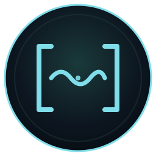
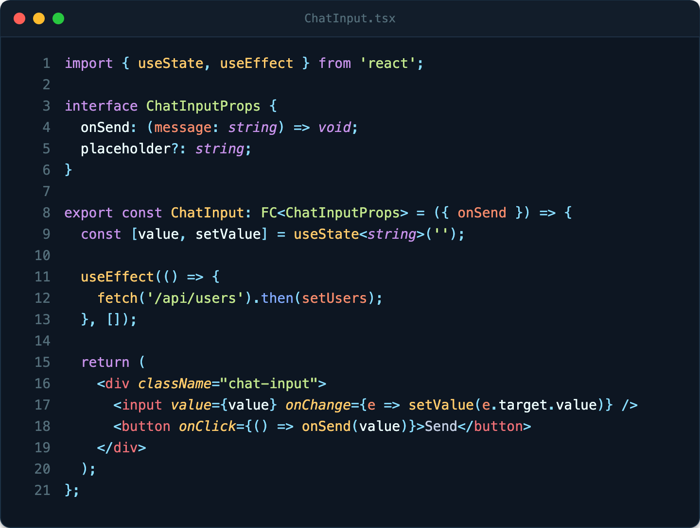
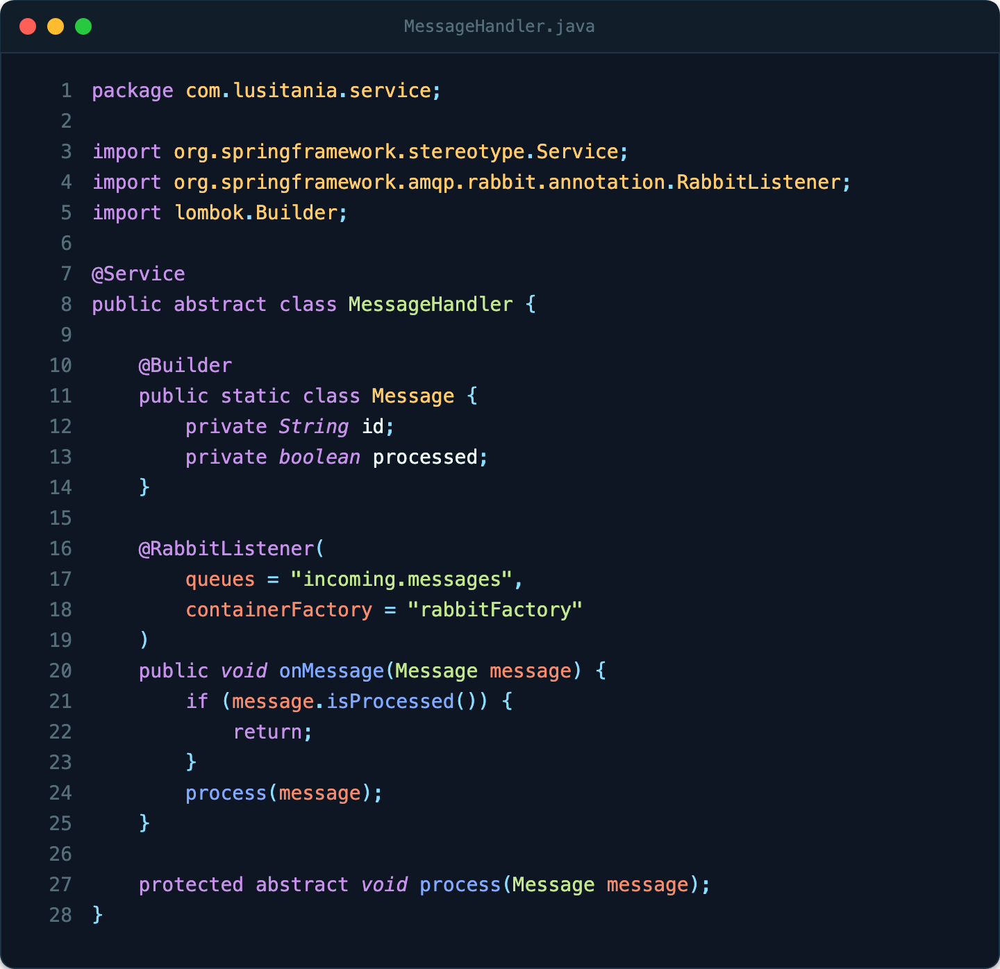
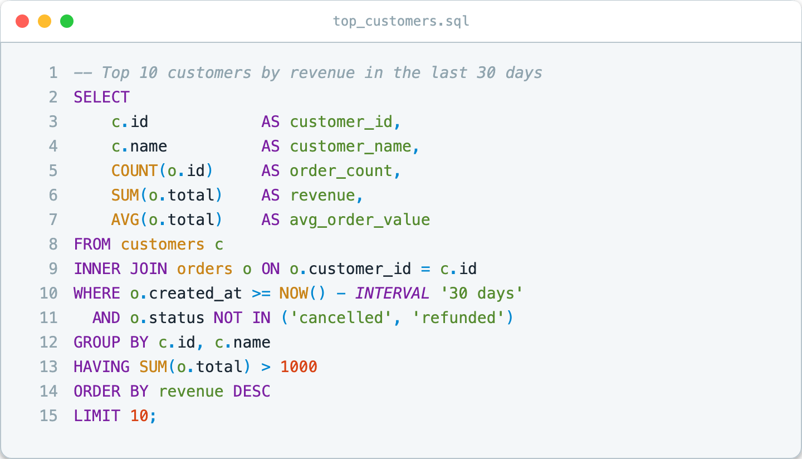

<div align="center">



# Lusitania Theme

**A deep-sea theme for VS Code & Cursor.**
Abyssal blue. Teal currents. Eight depths.

[](https://github.com/sahernandezz/lusitania-theme)
[](LICENSE.txt)
[](https://code.visualstudio.com/)

</div>

---

Named after the RMS Lusitania, the ocean liner that disappeared into the Atlantic depths in 1915. A deep oceanic palette — abyssal blue backgrounds, teal accents — built to be readable for long sessions across any language.

## Variants

Six dark depths and two lights. **Abyssal** is the canonical one.

| | Name | Background | Use it when |
|---|---|---|---|
|  | **Trench** | `#0a0a0a` | Maximum contrast, OLED screens. |
|  | **Midnight** | `#15171c` | Soft black, long sessions, less eye strain. |
|  | **Abyssal** ★ | `#0d1620` | The canonical theme. Deep oceanic blue. |
|  | **Abyssal Deep** | `#0a0d14` | Darker, dramatic. Matches the icon. |
|  | **Steel** | `#1c1f26` | Mid depth, grey-blue like a ship's hull. |
|  | **Oceanic** | `#263238` | Classic Material Oceanic. |
|  | **Surface** | `#fafafa` | Light, neutral. Bright environments. |
|  | **Abyssal Light** | `#f4f7f9` | Light with a subtle blue-green tint. |

Switch with `Cmd/Ctrl+K Cmd/Ctrl+T`.

## Install

**Marketplace** — search `Lusitania Theme`, install, then `Cmd/Ctrl+K Cmd/Ctrl+T` → pick a variant.

**`.vsix`**
```sh
code --install-extension lusitania-theme-1.1.1.vsix
```

**From source**
```sh
git clone https://github.com/sahernandezz/lusitania-theme.git
cd lusitania-theme
code .   # press F5 to launch an Extension Development Host
```

## See it in action

Three sample languages, each in a different variant — illustrative, not prescriptive. Every grammar VS Code knows about is themed.

### TypeScript / React — *Abyssal*

<p align="center"></p>

### Java + Spring annotations — *Abyssal Deep*

<p align="center"></p>

### SQL — *Abyssal Light*

<p align="center"></p>

## Syntax rules at a glance

| Element | Color | Example |
|---|---|---|
| Keywords | purple | `const`, `import`, `class`, `SELECT` |
| Strings | green | `'hello'`, `"world"` |
| Numbers | orange | `42`, `3.14` |
| Methods | blue | `.toString()`, `onMessage()` |
| Free functions / hooks | yellow | `console.log`, `useState`, `COUNT()` |
| Classes / enums | yellow | `ChatInput`, `Status` |
| Interfaces / types / abstract | green | `User`, `Promise<T>`, `abstract class` |
| JSX tags | red | `<div>`, `<ChatInput>` |
| JSX attrs | yellow italic | `value`, `onChange` |
| Parameters | orange | function args |
| Annotations | purple | `@Service`, `@RabbitListener` |
| Annotation arg names | orange | `queues = ...` |
| SQL tables | yellow | `customers`, `orders` |
| SQL columns | bright | `customer_id`, `total` |
| Comments | dim italic | `// ...`, `-- ...` |

## Pairs well with

[Lusitania Icon Theme](https://github.com/sahernandezz/lusitania-icon-theme) — matching file & folder icons, same palette.

## Security

This extension is **purely declarative** and ships only static assets:

- `package.json` has no `main`, `activationEvents`, `scripts`, `extensionDependencies` or `extensionPack` — VS Code never executes code from this package.
- The only contribution is `themes` (eight static JSON colour definitions).
- No network calls, no telemetry, no file-system access.

## Build

Theme JSONs are generated by [`build.py`](build.py) from a shared palette; preview images are generated by [`build_previews.py`](build_previews.py). Both use Python 3 standard library — no external dependencies.

```sh
python3 build.py            # rewrites themes/*.json
python3 build_previews.py   # rewrites previews/*.svg and previews/*.png (needs npx svgexport)
```

## License

[MIT](LICENSE.txt).
